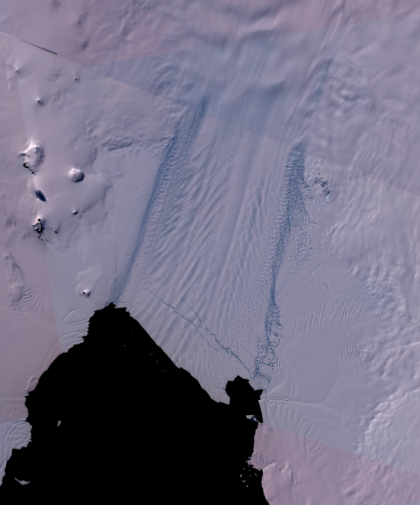

Created by Maaike Izeboud (m.izeboud@tudelft.nl | @izeboudmaaike )

# Intro
This repository provides code for the Normalised Radon Transform Damage (NeRD) detection method.
The code in this repository accompanies the paper "Damage Detection on Antarctic Ice Shelves
using the Normalised Radon Transform" by M. Izeboud and S. Lhermitte, in review at Remote Sensing of Environment (2022).

# About
NeRD is an automated method that detects damage and its orientation from a (high resolution) image.

It has so far been tested/applied on:
- Optical imagery from Sentinel-2 and Landsat 7/8 satellites
- SAR imagery from Sentinel-1 and RAMP RadarSat

NeRD follows the following steps:
- Read image (.tif) and convert to grayscale
- Cut image into small windows of NxN pixels
- Apply the Normalised Radon Transform to each window, which yields a (single) dominant angle & signal value for each window
- Calculate damage signal and orientation from output

# Structure of the repo
This repository provides code for NeRD in both Matlab and Python.

- config_files: this folder contains an example configuration file that is used to define parameter settings used in NeRD (python application)
- data: this folder contains an example image.tif and its detected damage
- files: this folder contains necessary files to run the included example
- matlab: code of NeRD method, including example script
- python: code of NeRD method, including example notebook

# Data
File convention:
If an image with filename 'image.tif' is used, NeRD output will have the following convention:
- image.nc or image.mat (python / matlab application), containing all output variables.
- image_[VARIABLE].tif with the output VARIABLE name, for example "alphaC" or "dmg"

# How to apply NeRD
- Make sure you have an image.tif available on your local machine (or use the example)
- Matlab: open the script ./matlab/scripts/NeRD_example.m
    - This requires the ./matlab/functions/ directory to be part of your matlab path
    - Update the path locations in the script
    - Run the script
- Python (notebook):
    - Create an environment and install all required packages as specified in ./python/required_packages.txt; activate environment
    - Open the notebook ./python/notebooks/example_NeRD.ipynb
    - Run the notebook
- Python (script):
    - Create an environment and install all required packages as specified in ./python/required_packages.txt
    - Create a config.ini file in ./config_files/ with the desired settings (or use config_NeRD_example.ini)
    - run python from the terminal:
    `python ./scripts/main.py ./config_files/config_file.ini ./path/to/image.tif`

# Example 

